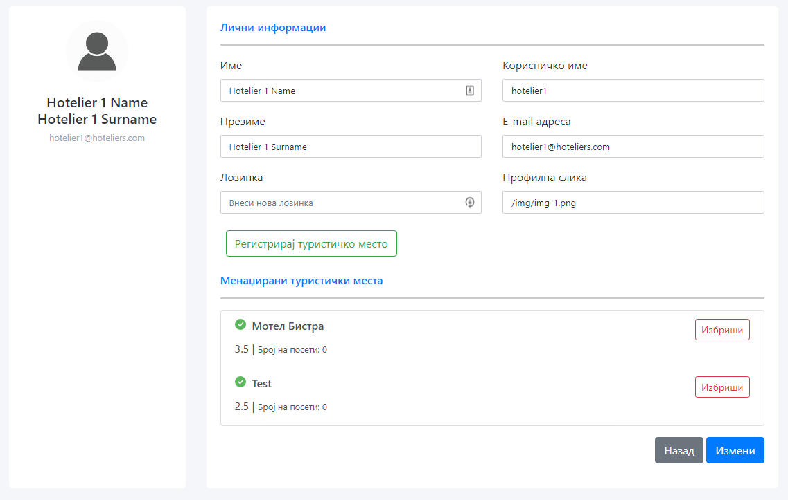
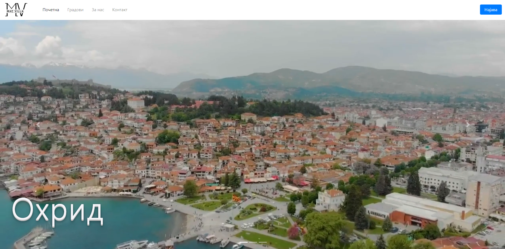
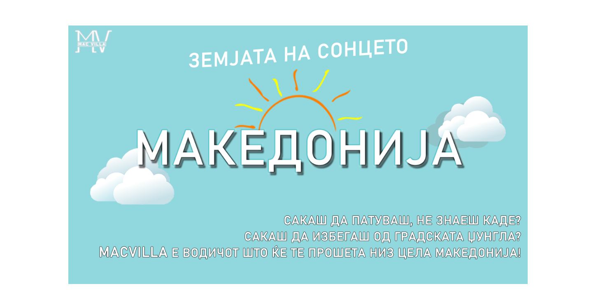

 
  

# MacVilla
*Travel guide for tourists in Macedonia, looking for villas, hotels, restaurants or
tourist attractions*
___
## Technologies used
* Java
* Spring Boot
* Java 8 Stream API
* REST API
* Vue.js
* Bootstrap
* PostgreSQL
* HTML/CSS/JS

## Functionalities
* Sign up/log in (three different types of users: basic, hotelier, admin)
* User dashboard (for each type of user)
* Post place as hotelier (after the admin approves the request)
* Automatically make a request with status PENDING and current date and time, which the admin has to approve, so the place can appear on the page
* List of favorite places
* Wizard that helps you choose a place (in development)
* Search, filter, sort   
* Post comment and rate a place
* Contact form for contacting us
* Custom 404 and 403 pages

## The team
* Strasho Naumov
    * strase10naumov@outlook.com
* Jelena Ognjanoska
    * jelena.ognjanoska@students.finki.ukim.mk

## Sample Images
*Login page*

*Register page*

*Admin dashboard*

*Hotelier dashboard*

*User dashboard*

*Home page*

*Contact us page*

*About us page*

*403 Forbidden page*

*404 Not found page*

